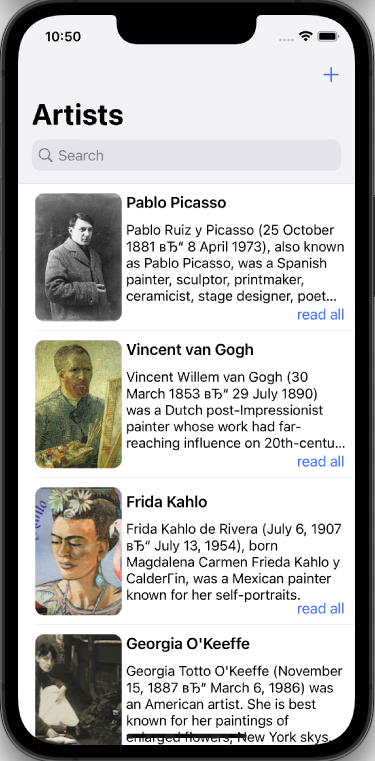
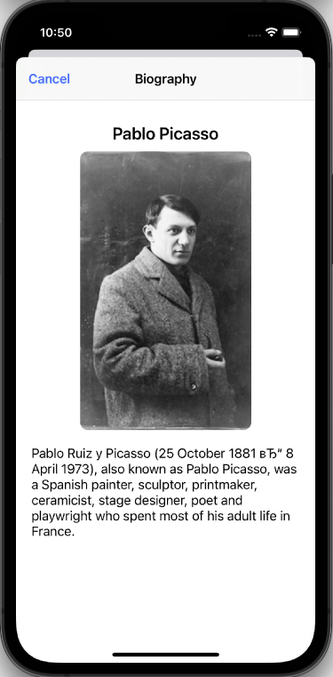
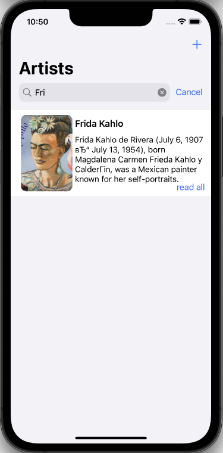
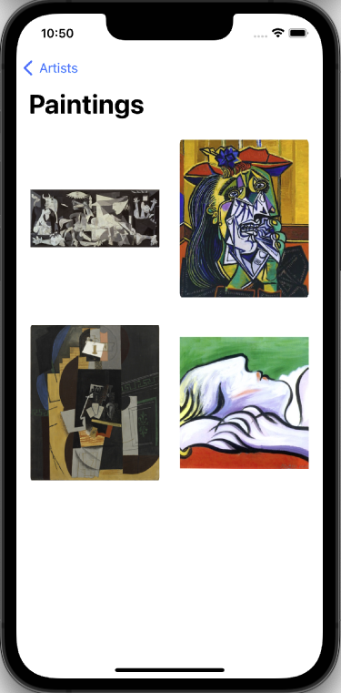
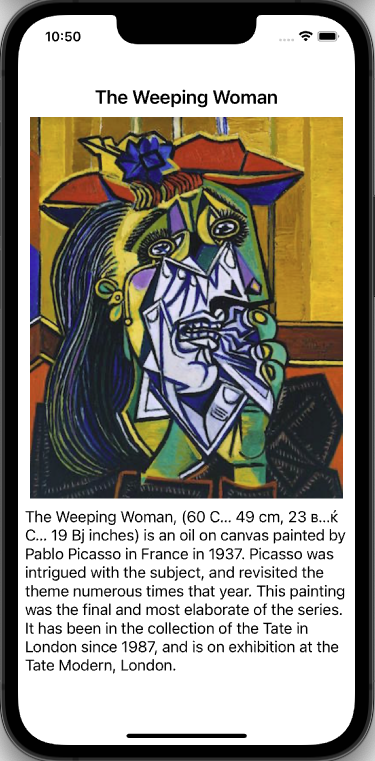

# CatalogOfPaintings

#### Реализовано базовое задание
- Главный экран авторов с краткой биографией
- По нажатию на кнопку "read all" открывается экран с полным текстом биографии
- Реализован поиск автора по имени
- Экран "Paintings" отображает все картины автора
- Увеличение картинки и ее уменьшение по нажатию

#### Реализовать:
- Прокрутка картин автора в режиме полноэкранного просмотра
- Поддержку горизонтальной ориентации 
- добавить возможность добавлять в приложение художников и картин

 

 

